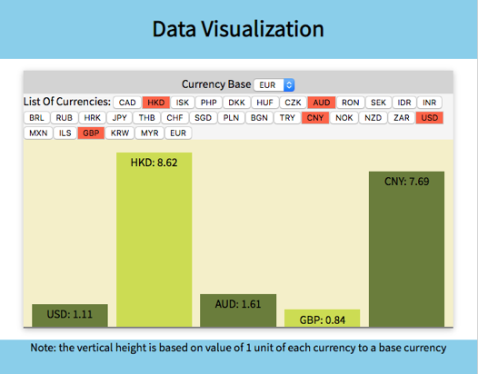

# data-visualization-js

- A Simple Javascript to fetch exchange currency data and present them as a bar chart.
- One page site(https://ishinan.github.io/data-visualization-js/)
- Sample Image
  
  

## Chart Feature

- When reloaded,  default five currencies are selected.
- Default Base Currency is EURO.
- The vertical height indicate comparison of 1 unit of value among currency to a base currency.
  - E.g. If a base currency is EURO, and  Indian rupee (INR) is 80.0. The height of INR to EURO is 80 times higher.
- Clicking a button of currency add/remove the currency bar in the chart

## Design Info

The site is created by one html page with css for style and javascript for event actions such as clicking a button. The height of the bars in the chart is adjusted by the largest number of currency to fit in the chart. Everytime clicking a button or dropdown, the data is fetched from the http://exchangeratesapi.io.

### Data

- The currency data is retrieved from http://exchangeratesapi.io. 

### Javascript

- The code is written by vanila javascript. No libraries or frameworks are used.
- The height of the bars in the chart is adjusted by the largest number of currency to fit in the chart. 
- Everytime clicking a button or dropdown, the data is fetched from the http://exchangeratesapi.io.

### Style

- Font-Family: 'Source Sans Pro'(sourcce: Google Font), sans-serif

- Four main colors are used
  - Header/Footer sections: #fe9801
  - Background of Chart: #f4eec7
  - Bar Chart colors: #ccda46, #697c37
